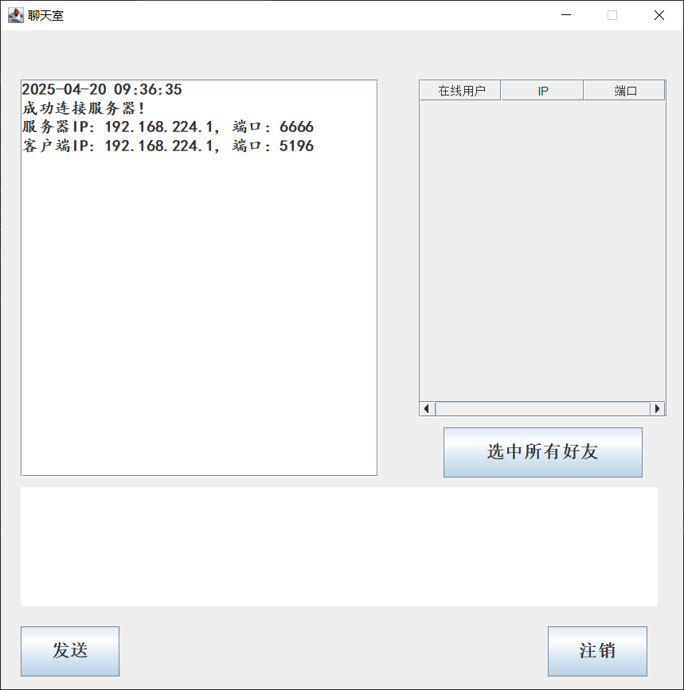

# 简易聊天小程序

## 技术栈

Java SE、Java Swing、Java AWT

## 项目描述

聊天室共分为客户端和服务端两部分，服务器程序主要负责侦听客户端发来的消息，客户端需要连接到服务器才可以实现正常的聊天功能。

未做登录功能，仅用多线程实现基本的聊天功能。

## 运行截图

## 运行程序

先运行Server_2.java

再运行Client_2.java    可同时运行多个